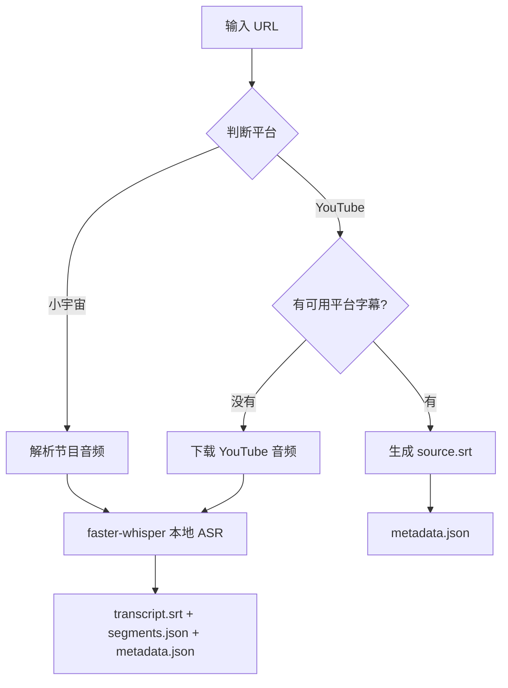

# Podcast To Text

[English](README.md)

使用 `faster-whisper` 本地转写小宇宙播客，并优先提取 YouTube 平台字幕。

## 为什么有这个项目

播客现在作为个人主要的获取信息渠道的重要方式之一，它的信息来源非常新，可以快速吸收新知，但有一个痛点，就是听完后，回顾时，无法快速回顾，缺乏文字版作二次 review。

我主要用 小宇宙和 youtube ，但是小宇宙只有 App 端才有实时的转录功能，没有离线功能，youtube 也一样。

这个工具就是为了解决这个问题：给任意一期小宇宙播客或 YouTube 视频生成本地字幕文件，方便搜索、引用和归档。

## 快速开始

```bash
python -m podcast_to_text.cli \
  "https://www.xiaoyuzhoufm.com/episode/69b4d2f9f8b8079bfa3ae7f2" \
  --model small --device cpu --compute-type int8 --limit-seconds 45
```

YouTube 链接也可以用同一个入口：

```bash
python -m podcast_to_text.cli \
  "https://www.youtube.com/watch?v=jNQXAC9IVRw" \
  --model small --device cpu --compute-type int8 --limit-seconds 45
```

转写中文播客时，可以用 `large-v3` 模型并添加术语提示：

```bash
python -m podcast_to_text.cli \
  "https://www.xiaoyuzhoufm.com/episode/69b4d2f9f8b8079bfa3ae7f2" \
  --model large-v3 --device cpu --compute-type int8 --beam-size 1 \
  --initial-prompt "世界零 Sheet0 创始人王文锋 曲凯 AI Agent Manus" \
  --limit-seconds 45
```

## 参数说明

CLI 默认参数是：

```text
--model medium --device cpu --compute-type int8 --language zh --beam-size 5
```

根据不同场景，可以参考这些参数组合：

| 使用场景 | 推荐参数 | 说明 |
| --- | --- | --- |
| 快速验证链接和模型 | `--model small --device cpu --compute-type int8 --limit-seconds 45` | 用于测试下载、音频提取和 SRT 输出是否正常。 |
| 日常转写完整音频 | `--model medium --device cpu --compute-type int8` | 当前 CLI 默认配置。速度比 `large-v3` 快，质量可以接受。 |
| 中文播客高质量转写 | `--model large-v3 --device cpu --compute-type int8 --beam-size 1 --initial-prompt "<人名 术语>"` | 本机实测可用的高质量方案。比 `medium` 慢，但质量更好，长音频也能跑完。 |
| 追求最高质量 | `--model large-v3 --device cpu --compute-type int8` | 使用默认 `--beam-size 5`，比 `beam-size 1` 慢，但搜索空间更大。 |

`large-v3` 在长音频和中文场景下通常比 `small` 和 `medium` 更准确，但速度也更慢。`--compute-type int8` 可以降低 CPU 内存占用和运行时间。`--initial-prompt` 对人名、公司名和专业术语的识别很有帮助，建议在正式转写前先列出这些关键词。

## 输出文件

默认情况下，每个节目或视频会写入 `output` 目录下，使用可读的目录名：

```text
output/<title>__<short-id>/
```

例如：

```text
output/OpenClaw 之后，我只想未来 3-6 个月的事情｜对谈 Sheet0 创始人王文锋__69b4d2f9/
```

每个输出目录按实际处理路径包含：

- `metadata.json` - 本次任务的源链接、标题、平台 ID、参数、模型信息和耗时统计
- `source.srt` - YouTube 平台字幕转换出的源字幕；存在该文件时不会运行 ASR
- `segments.json` - ASR 路径的 Whisper 分段结果
- `transcript.srt` - ASR 路径生成的 SRT 字幕文件
- `audio_sample.wav` - ASR 路径使用 `--limit-seconds` 时生成的测试音频
- `audio.<ext>` - ASR 路径未使用 `--limit-seconds` 时下载的完整原始音频

## 环境要求

- Python 3.10 或更高版本
- 能访问小宇宙网页、音频文件、YouTube 视频音频
- 使用 `--limit-seconds` 时需要 `ffmpeg`
- CPU 可运行，推荐 `--compute-type int8`
- 如果使用 CUDA，需要本机 CUDA 环境可用

## 安装

在项目根目录执行：

```bash
python -m venv .venv
source .venv/bin/activate  # Linux/Mac
# .venv\Scripts\activate   # Windows

pip install -r requirements.txt
pip install -e .
```

或者安装开发依赖（Windows）：

```powershell
python -m venv .venv
.\.venv\Scripts\python.exe -m pip install -U pip
.\.venv\Scripts\python.exe -m pip install -e ".[dev]"
```

## 命令参数

| 参数 | 默认值 | 说明 |
| --- | --- | --- |
| `url` | 必填 | 小宇宙单集 URL 或 YouTube URL |
| `--out-dir` | `output` | 输出根目录 |
| `--model` | `medium` | `faster-whisper` 模型名，例如 `tiny`、`small`、`medium`、`large-v3` |
| `--device` | `cpu` | 推理设备，例如 `cpu`、`cuda`、`auto` |
| `--compute-type` | `int8` | 计算类型，例如 `int8`、`float16`、`float32` |
| `--language` | `zh` | 转写语言，传空值时由 Whisper 自动判断 |
| `--beam-size` | `5` | Whisper 解码 beam size，数值越大通常越慢 |
| `--vad-filter` | 关闭 | 启用 VAD 过滤，适合长静音较多的音频 |
| `--initial-prompt` | 无 | 给 Whisper 的上下文提示，适合放人名、术语、节目名 |
| `--limit-seconds` | 无 | 只转写前 N 秒，用于快速测试 |
| `--dir-template` | `title-id` | 输出目录名格式，`title-id` 为 `<title>__<short-id>`，`id` 为纯 ID 格式 |

## 支持的链接格式

小宇宙：

```text
https://www.xiaoyuzhoufm.com/episode/<24位 episode id>
https://xiaoyuzhoufm.com/episode/<24位 episode id>
```

YouTube：

```text
https://www.youtube.com/watch?v=<video id>
https://youtu.be/<video id>
https://www.youtube.com/shorts/<video id>
https://www.youtube.com/live/<video id>
```

## 运行测试

安装开发依赖后执行：

```bash
pytest
```

## 小宇宙字幕线索

部分小宇宙节目页面会暴露字幕元数据（如 `transcriptMediaId`），但公开网页无法直接获取字幕正文。CLI 会将这些线索记录在 `metadata.json` 的 `platform_transcript_hint` 字段中，但实际转写通过本地 `faster-whisper` 完成，不依赖小宇宙 App 的字幕 API。

## 项目结构

```
podcast-to-text/
├── src/
│   └── podcast_to_text/
│       ├── cli.py              # 命令行入口
│       ├── xiaoyuzhou.py       # 小宇宙音频解析
│       ├── youtube.py          # YouTube 字幕提取和音频下载
│       ├── outputs.py          # SRT 渲染和 VTT 转 SRT
│       ├── transcriber.py      # Whisper 转写封装
│       └── files.py            # 输出目录命名
├── tests/                      # 测试文件
├── output/                     # 默认输出目录
└── requirements.txt            # 依赖列表
```

## 工作原理



**核心流程说明：**

1. 小宇宙：解析音频后走本地 `faster-whisper` 转写。
2. YouTube：优先复用平台字幕，直接输出 `source.srt`。
3. YouTube 没有可用字幕时，才下载音频并回退到本地 ASR。
4. ASR 路径输出 `transcript.srt`、`segments.json` 和 `metadata.json`。
