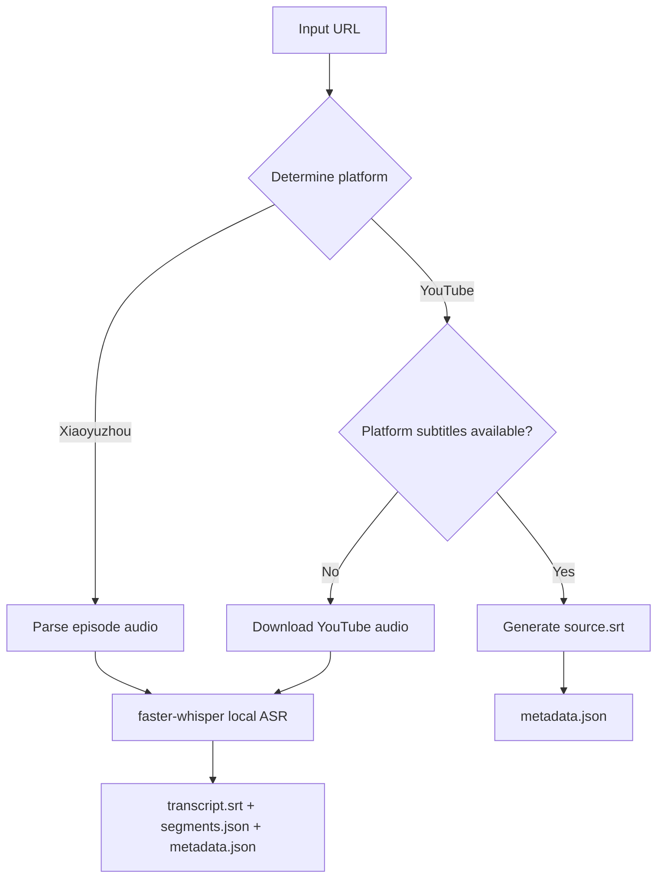

# Podcast To Text

[中文](README-zh.md)

Local Xiaoyuzhou podcast transcription and YouTube subtitle extraction using `faster-whisper`.

## Why This Project

Podcasts are now one of the primary ways I consume information. The content is fresh and helps me absorb new knowledge quickly, but there's a pain point: after listening, it's hard to quickly review key moments without a text version for secondary review.

I mainly use Xiaoyuzhou and YouTube, but Xiaoyuzhou only has real-time transcription in the App with no offline option, and YouTube is the same.

This tool solves that problem: generate local subtitle files for any Xiaoyuzhou episode or YouTube video, making it easy to search, quote, and archive.

## Quick Start

```bash
python -m podcast_to_text.cli \
  "https://www.xiaoyuzhoufm.com/episode/69b4d2f9f8b8079bfa3ae7f2" \
  --model small --device cpu --compute-type int8 --limit-seconds 45
```

YouTube links work with the same entry point:

```bash
python -m podcast_to_text.cli \
  "https://www.youtube.com/watch?v=jNQXAC9IVRw" \
  --model small --device cpu --compute-type int8 --limit-seconds 45
```

For Chinese podcast transcription, use the `large-v3` model with terminology hints:

```bash
python -m podcast_to_text.cli \
  "https://www.xiaoyuzhoufm.com/episode/69b4d2f9f8b8079bfa3ae7f2" \
  --model large-v3 --device cpu --compute-type int8 --beam-size 1 \
  --initial-prompt "世界零 Sheet0 创始人王文锋 曲凯 AI Agent Manus" \
  --limit-seconds 45
```

## Parameter Guide

The CLI defaults are:

```text
--model medium --device cpu --compute-type int8 --language zh --beam-size 5
```

Recommended parameter combinations for different scenarios:

| Use Case | Recommended Parameters | Notes |
| --- | --- | --- |
| Quick validation | `--model small --device cpu --compute-type int8 --limit-seconds 45` | For testing download, audio extraction, and SRT output. |
| Daily full transcription | `--model medium --device cpu --compute-type int8` | Current CLI default. Faster than `large-v3` with acceptable quality. |
| High-quality Chinese podcast | `--model large-v3 --device cpu --compute-type int8 --beam-size 1 --initial-prompt "<names terms>"` | Tested high-quality setup for this machine. Slower than `medium`, but better quality and handles long audio well. |
| Maximum quality | `--model large-v3 --device cpu --compute-type int8` | Uses default `--beam-size 5`; slower than `beam-size 1`, but wider search space. |

`large-v3` is usually more accurate for long audio and Chinese scenarios than `small` and `medium`, but it's also slower. `--compute-type int8` reduces CPU memory usage and runtime. `--initial-prompt` is very helpful for recognizing names, company names, and technical terms—recommend listing these keywords before formal transcription.

## Output Files

By default, each episode or video is written to the `output` directory using a readable directory name:

```text
output/<title>__<short-id>/
```

For example:

```text
output/OpenClaw 之后，我只想未来 3-6 个月的事情｜对谈 Sheet0 创始人王文锋__69b4d2f9/
```

Each output directory contains (depending on the processing path):

- `metadata.json` - source URL, title, platform ID, parameters, model info, and timing stats
- `source.srt` - source subtitles converted from YouTube platform subtitles; ASR is skipped when this file exists
- `segments.json` - Whisper segment results from ASR path
- `transcript.srt` - SRT subtitle file generated from ASR path
- `audio_sample.wav` - test audio generated when using `--limit-seconds` in ASR path
- `audio.<ext>` - full downloaded original audio when not using `--limit-seconds` in ASR path

## Environment Requirements

- Python 3.10 or higher
- Access to Xiaoyuzhou web pages, audio files, and YouTube video audio
- `ffmpeg` required when using `--limit-seconds`
- Runs on CPU, recommend `--compute-type int8`
- For CUDA usage, local CUDA environment must be available

## Installation

In the project root directory:

```bash
python -m venv .venv
source .venv/bin/activate  # Linux/Mac
# .venv\Scripts\activate   # Windows

pip install -r requirements.txt
pip install -e .
```

Or install with development dependencies (Windows):

```powershell
python -m venv .venv
.\.venv\Scripts\python.exe -m pip install -U pip
.\.venv\Scripts\python.exe -m pip install -e ".[dev]"
```

## CLI Parameters

| Parameter | Default | Description |
| --- | --- | --- |
| `url` | Required | Xiaoyuzhou episode URL or YouTube URL |
| `--out-dir` | `output` | Output root directory |
| `--model` | `medium` | `faster-whisper` model name, e.g. `tiny`, `small`, `medium`, `large-v3` |
| `--device` | `cpu` | Inference device, e.g. `cpu`, `cuda`, `auto` |
| `--compute-type` | `int8` | Compute type, e.g. `int8`, `float16`, `float32` |
| `--language` | `zh` | Transcription language; empty value lets Whisper auto-detect |
| `--beam-size` | `5` | Whisper decoding beam size; higher values are usually slower |
| `--vad-filter` | Disabled | Enable VAD filtering for audio with long silences |
| `--initial-prompt` | None | Context hint for Whisper, good for names, terms, and show titles |
| `--limit-seconds` | None | Transcribe only the first N seconds for quick testing |
| `--dir-template` | `title-id` | Output directory name format: `title-id` for `<title>__<short-id>`, `id` for ID-only format |

## Supported URL Formats

Xiaoyuzhou:

```text
https://www.xiaoyuzhoufm.com/episode/<24-character episode id>
https://xiaoyuzhoufm.com/episode/<24-character episode id>
```

YouTube:

```text
https://www.youtube.com/watch?v=<video id>
https://youtu.be/<video id>
https://www.youtube.com/shorts/<video id>
https://www.youtube.com/live/<video id>
```

## Running Tests

After installing development dependencies:

```bash
pytest
```

## Xiaoyuzhou Transcript Hints

Some Xiaoyuzhou episode pages expose transcript metadata (such as `transcriptMediaId`), but the public web page does not directly provide the transcript text. The CLI records these hints in the `platform_transcript_hint` field in `metadata.json`, but actual transcription is done through local `faster-whisper` without depending on the Xiaoyuzhou App's transcript API.

## Project Structure

```
podcast-to-text/
├── src/
│   └── podcast_to_text/
│       ├── cli.py              # CLI entry point
│       ├── xiaoyuzhou.py       # Xiaoyuzhou audio parsing
│       ├── youtube.py          # YouTube subtitle extraction and audio download
│       ├── outputs.py          # SRT rendering and VTT to SRT conversion
│       ├── transcriber.py      # Whisper transcription wrapper
│       └── files.py            # Output directory naming
├── tests/                      # Test files
├── output/                     # Default output directory
└── requirements.txt            # Dependencies
```

## How It Works



**Core Flow:**

1. Xiaoyuzhou: Parses audio then uses local `faster-whisper` transcription.
2. YouTube: Prefers platform subtitles, directly outputs `source.srt`.
3. YouTube without usable subtitles: Falls back to audio download and local ASR.
4. ASR path outputs `transcript.srt`, `segments.json`, and `metadata.json`.
